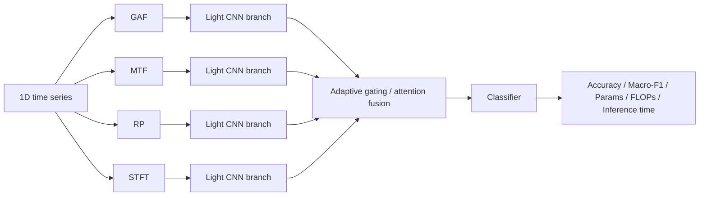

# Adaptive Fusion TS2Img

[](#)
[](#)
[](#)
[](#)

**Adaptive Fusion TS2Img** is a research-oriented codebase for **time-series classification** using multiple two-dimensional representations of one-dimensional time series. The project converts a 1D signal into several 2D images, extracts features using lightweight CNN branches, and combines them through an **adaptive gating / attention fusion** mechanism.

This repository is intended for academic experiments, reproducibility, and paper development. It is **not** a production software package and should not be treated as a finalized benchmark implementation.

---

## 1. Research direction

Working topic:

> **A Lightweight Adaptive Fusion Network of Two-Dimensional Representations for Time-Series Classification**

The central idea is that different time-series imaging methods emphasize different signal properties:

| Representation | Main information emphasized | Typical intuition |
|---|---|---|
| **GAF / GASF / GADF** | Angular correlation and temporal shape relationship | Useful when global shape and pairwise temporal correlation matter |
| **MTF** | Markov transition probabilities between discretized signal states | Useful when state transition patterns are informative |
| **RP** | Recurrence of system states in phase space | Useful for periodic, repetitive, or nonlinear dynamics |
| **STFT** | Time-frequency energy distribution | Useful for oscillatory, vibration, acoustic, or biomedical signals |

Instead of manually selecting one representation or using fixed fusion, the proposed model learns representation weights adaptively.

---

## 2. Main pipeline

```text
1D time series
    -> GAF / MTF / RP / STFT
    -> lightweight CNN feature branches
    -> adaptive gating / attention fusion
    -> classifier
    -> metrics, complexity, fusion-weight analysis
```

Optional Mermaid view:



---

## 3. What this repository is designed to support

This codebase is organized for a staged research workflow:

1. **Smoke testing** on a small number of datasets to verify that data loading, transforms, training, checkpointing, and output generation work.
2. **Pilot experiments** on a moderate number of datasets to inspect trends and failure cases.
3. **Paper-grade experiments** on at least 20 datasets with multiple seeds, baselines, statistical tests, and ablation studies.
4. **Stronger Q1/Q2-scale experiments** on 30--50 datasets, preferably with 5 seeds where computation allows.

For a journal-quality paper, do not rely on a single run or only a few datasets. Report at least:

- Accuracy and Macro-F1;
- Precision, recall, and possibly AUC when appropriate;
- number of trainable parameters;
- FLOPs;
- training time;
- inference time per sample;
- average rank across datasets;
- statistical tests such as Friedman and Wilcoxon/Nemenyi;
- ablation study by removing representation branches;
- adaptive fusion weights, for example `alpha_GAF`, `alpha_MTF`, `alpha_RP`, `alpha_STFT`.

---

## 4. Repository structure

```text
adaptive-fusion-ts2img/
├── config/
│   ├── default.yaml
│   ├── README.md
│   ├── experiments/          # single adaptive-fusion experiment configs
│   ├── baselines/            # 1D-CNN, single 2D, manual fusion configs
│   ├── ablations/            # configs for removing representation branches
│   └── suites/               # staged multi-dataset / multi-seed experiment suites
├── data/
│   └── UCR/                  # local UCR/UEA datasets; do not commit raw datasets
├── docs/
│   └── EXPERIMENT_STAGES.md
├── notebooks/
│   ├── 01_colab_pipeline_commands_only.ipynb
│   ├── 02_local_pipeline_commands_only.ipynb
│   └── README.md
├── src/
│   ├── cli/                  # batch run, result collection, ranking, statistical tests
│   ├── data/                 # UCR/UEA reading utilities
│   ├── datasets/             # PyTorch dataset wrappers
│   ├── models/               # CNN1D, AdaptiveFusionCNN, lightweight CNN branches
│   ├── transforms/           # GAF, MTF, RP, STFT transforms
│   └── utils/                # config, metrics, seed, logging, experiment utilities
├── outputs/                  # generated run outputs; should not be committed
├── cache/                    # cached transformed images; should not be committed
├── results/                  # optional summarized results; keep only lightweight summaries
├── scripts/
│   └── git_push_commands.txt
├── COLAB_QUICKSTART.md
├── requirements.txt
├── .gitignore
└── README.md
```

The project follows a **command-only notebook** policy: notebooks should call CLI commands, while research logic should stay in `src/` and experiment settings should stay in YAML files under `config/`.

---

## 5. Installation

### 5.1. Clone the repository

```bash
git clone https://github.com/hoangtnedu/adaptive-fusion-ts2img.git
cd adaptive-fusion-ts2img
```

### 5.2. Create a virtual environment

Windows:

```bash
python -m venv .venv
.venv\Scripts\activate
```

Linux/macOS:

```bash
python -m venv .venv
source .venv/bin/activate
```

### 5.3. Install dependencies

```bash
python -m pip install --upgrade pip
pip install -r requirements.txt
```

The main dependency groups are:

- numerical/data processing: `numpy`, `pandas`, `scipy`;
- machine learning and metrics: `scikit-learn`;
- image processing: `scikit-image`;
- time-series imaging: `pyts`;
- deep learning: `torch`, `torchvision`;
- complexity measurement: `thop`;
- configuration and plotting: `pyyaml`, `matplotlib`.

### 5.4. Quick source check

```bash
python -m compileall src
```

---

## 6. Dataset preparation

Raw UCR/UEA datasets are **not included** in this repository. Place datasets locally under `data/UCR/` using the standard train/test split.

Example structure:

```text
data/UCR/Coffee/Coffee_TRAIN.tsv
data/UCR/Coffee/Coffee_TEST.tsv

data/UCR/ECG200/ECG200_TRAIN.tsv
data/UCR/ECG200/ECG200_TEST.tsv

data/UCR/GunPoint/GunPoint_TRAIN.tsv
data/UCR/GunPoint/GunPoint_TEST.tsv
```

Each `.tsv` file is expected to follow this format:

```text
label    value_1    value_2    value_3    ...    value_T
```

The first column is the class label. All remaining columns are time-series values.

Before running large experiments, verify that dataset folder names and file names exactly match the names used in the YAML configuration files.

---

## 7. Recommended notebooks

For Google Colab:

```text
notebooks/01_colab_pipeline_commands_only.ipynb
```

For local execution with VS Code, Visual Studio, or terminal:

```text
notebooks/02_local_pipeline_commands_only.ipynb
```

For Colab-specific setup, see:

```text
COLAB_QUICKSTART.md
```

---

## 8. Running a single experiment

Example: adaptive fusion on Coffee.

```bash
python -m src.train --config config/experiments/coffee_adaptive_fusion.yaml
```

Example baselines:

```bash
python -m src.train --config config/baselines/cnn1d.yaml
python -m src.train --config config/baselines/single_gaf.yaml
python -m src.train --config config/baselines/single_mtf.yaml
python -m src.train --config config/baselines/single_rp.yaml
python -m src.train --config config/baselines/single_stft.yaml
python -m src.train --config config/baselines/manual_feature_concat.yaml
python -m src.train --config config/baselines/manual_feature_mean.yaml
```

Run from the repository root. If `ModuleNotFoundError: src` appears, check that the current directory is `adaptive-fusion-ts2img/`.

---

## 9. Staged experiment suites

Run experiments from small to large. Do **not** start paper-grade runs until the smoke and pilot stages work correctly.

| Stage | Purpose | Suite file |
|---|---|---|
| Stage 1 | Smoke test on 5 datasets, 3 seeds, all main methods | `config/suites/stage1_smoke_5datasets_3seeds_all_methods.yaml` |
| Stage 2 | Pilot experiment on 12 datasets, 3 seeds | `config/suites/stage2_pilot_12datasets_3seeds_all_methods.yaml` |
| Stage 3 | Paper-grade minimum on 20 datasets, 3 seeds | `config/suites/stage3_paper_20datasets_3seeds_all_methods.yaml` |
| Stage 3 ablation | Ablation on 20 datasets for adaptive model | `config/suites/stage3_ablation_20datasets_3seeds_adaptive.yaml` |
| Stage 3 adaptive-only | Wider adaptive-only check on 30 datasets | `config/suites/stage3_paper_30datasets_3seeds_adaptive_only.yaml` |
| Stage 4 | Stronger Q1/Q2-scale run on 30 datasets, 5 seeds | `config/suites/stage4_strong_30datasets_5seeds_all_methods.yaml` |
| Stage 4 adaptive-only | Large adaptive-only run on 50 datasets, 3 seeds | `config/suites/stage4_strong_50datasets_3seeds_adaptive_only.yaml` |

### 9.1. Dry run

Use `--dry-run` first to check generated commands without training:

```bash
python -m src.cli.batch_run \
  --suite config/suites/stage1_smoke_5datasets_3seeds_all_methods.yaml \
  --dry-run
```

### 9.2. Stage 1 smoke test

```bash
python -m src.cli.batch_run \
  --suite config/suites/stage1_smoke_5datasets_3seeds_all_methods.yaml
```

### 9.3. Stage 2 pilot experiment

```bash
python -m src.cli.batch_run \
  --suite config/suites/stage2_pilot_12datasets_3seeds_all_methods.yaml
```

### 9.4. Stage 3 paper-grade minimum

```bash
python -m src.cli.batch_run \
  --suite config/suites/stage3_paper_20datasets_3seeds_all_methods.yaml
```

### 9.5. Stage 3 ablation

```bash
python -m src.cli.batch_run \
  --suite config/suites/stage3_ablation_20datasets_3seeds_adaptive.yaml
```

### 9.6. Stage 4 stronger Q1/Q2-scale run

```bash
python -m src.cli.batch_run \
  --suite config/suites/stage4_strong_30datasets_5seeds_all_methods.yaml
```

or adaptive-only:

```bash
python -m src.cli.batch_run \
  --suite config/suites/stage4_strong_50datasets_3seeds_adaptive_only.yaml
```

---

## 10. Collecting and analyzing results

Collect all run summaries into a single CSV file:

```bash
python -m src.cli.collect_results \
  --output-root outputs \
  --out-csv outputs/summary_all_runs.csv
```

Compute average rank using Macro-F1:

```bash
python -m src.cli.rank_results \
  --results-csv outputs/summary_all_runs.csv \
  --metric test_macro_f1
```

Run statistical tests:

```bash
python -m src.cli.statistical_tests \
  --results-csv outputs/summary_all_runs.csv \
  --metric test_macro_f1 \
  --proposed adaptive_fusion_full
```

Export paper-ready tables:

```bash
python -m src.cli.export_paper_tables \
  --results-csv outputs/summary_all_runs.csv \
  --out-dir outputs/paper_tables
```

---

## 11. Main output files

Each experiment should create an output directory under `outputs/`. Important files may include:

```text
summary.json                  # Accuracy, Macro-F1, precision, recall, complexity fields
config_used.yaml              # fully resolved configuration used in the run
environment.json              # Python, library, hardware, and environment information
best_model.pt                 # best checkpoint
last_checkpoint.pt            # latest checkpoint for resume
history.csv                   # epoch-wise training history
classification_report.txt     # class-level report
confusion_matrix.png          # confusion matrix
learning_curve_macro_f1.png   # learning curve
complexity.json               # trainable params and FLOPs, if measured
inference_time.json           # inference time per sample
alpha_mean.csv                # mean adaptive fusion weights
alpha_test_samples.csv        # per-sample adaptive fusion weights
```

For reproducibility, always keep `summary.json`, `config_used.yaml`, and `environment.json` for each run used in a paper table.

---

## 12. Resume interrupted training

If training is interrupted, rerun the same command:

```bash
python -m src.train --config config/experiments/coffee_adaptive_fusion.yaml
```

The training script should check `last_checkpoint.pt` in the output directory and continue if a valid checkpoint exists.

---

## 13. GitHub and storage rules

Commit only lightweight and reproducible project files:

```text
source code
YAML configuration files
command-only notebooks
documentation
requirements.txt
small summary tables or lightweight result summaries
```

Do **not** commit heavy or machine-specific files:

```text
data/UCR/*
outputs/*
cache/*
*.pt
*.pth
*.ckpt
large generated image caches
large raw result folders
```

Recommended update workflow:

```bash
git status
git add README.md config src notebooks docs requirements.txt
git commit -m "Update README for adaptive fusion experiment workflow"
git push
```

---

## 14. Troubleshooting

### Missing dataset files

Check the exact path:

```text
data/UCR/<DatasetName>/<DatasetName>_TRAIN.tsv
data/UCR/<DatasetName>/<DatasetName>_TEST.tsv
```

Dataset names are case-sensitive on Linux and Google Colab.

### Import error for `src`

Run commands from the repository root:

```bash
cd adaptive-fusion-ts2img
python -m src.train --config config/experiments/coffee_adaptive_fusion.yaml
```

### Colab runs slowly

For Colab, a practical pattern is:

```text
/content/adaptive-fusion-ts2img/     # source code
/content/drive/MyDrive/.../outputs/  # persistent outputs
/content/drive/MyDrive/.../cache/    # optional cache
```

Keeping source code under `/content` is usually faster than running everything directly from Google Drive.

### Results differ between runs

Check:

```text
seed
config_used.yaml
Python and library versions
CPU/GPU device
CUDA/cuDNN behavior
batch size
early stopping
checkpoint resume behavior
train/test split
image transform parameters
```

Small differences are expected across hardware and software environments, especially when GPU kernels are not fully deterministic.

### Very low Macro-F1

Inspect:

```text
class imbalance
label encoding
train/validation split
normalization method
learning curves
confusion matrix
early stopping epoch
whether the selected representation is suitable for the dataset
```

Accuracy alone can be misleading on imbalanced datasets. Macro-F1 should be examined carefully.

---

## 15. Reproducibility checklist for paper use

Before using results from this repository in a manuscript, record:

- dataset names and domains;
- original train/test split source;
- number of classes, train size, test size, and time-series length;
- transform configuration for GAF, MTF, RP, and STFT;
- image size;
- model architecture;
- fusion type;
- number of seeds;
- optimizer, learning rate, scheduler, batch size, epochs, early stopping;
- validation strategy;
- hardware and runtime environment;
- metrics and statistical tests;
- exact Git commit hash;
- `config_used.yaml` and `environment.json` for every reported run.

For a stronger Q1/Q2 submission, include multi-dataset statistical testing, ablation analysis, complexity reporting, and interpretation of fusion weights.

---

## 16. Citation and academic use

When using this repository in a thesis, report, or paper, describe clearly:

```text
- data source and dataset list;
- preprocessing and normalization;
- time-series-to-image transformations;
- CNN branch architecture;
- adaptive gating / attention mechanism;
- baselines;
- metrics;
- number of seeds;
- statistical testing protocol;
- hardware and software environment.
```

This repository does not by itself prove that adaptive fusion is superior. Conclusions should be drawn only after controlled experiments with enough datasets, seeds, baselines, statistical tests, and ablation studies.

---

## 17. Disclaimer

This repository is provided for **research, teaching, and experimental reproducibility**. The author does not guarantee that the code will run in every environment or reproduce identical results on every machine.

Experimental results may vary due to Python/PyTorch/CUDA/cuDNN versions, library updates, CPU/GPU differences, random seeds, dataset formatting, Colab runtime changes, checkpoint behavior, and YAML configuration changes.

Users are responsible for verifying data licenses, dataset correctness, environment setup, result validity, and manuscript claims before using this code for publication, teaching, reporting, or deployment.

This is **not commercial software**, **not a production system**, and **not a guaranteed benchmark package**.

---

## 18. License note

At the time of writing, this repository may not include an explicit `LICENSE` file. Add a clear open-source license before encouraging external reuse, redistribution, or derivative work.
